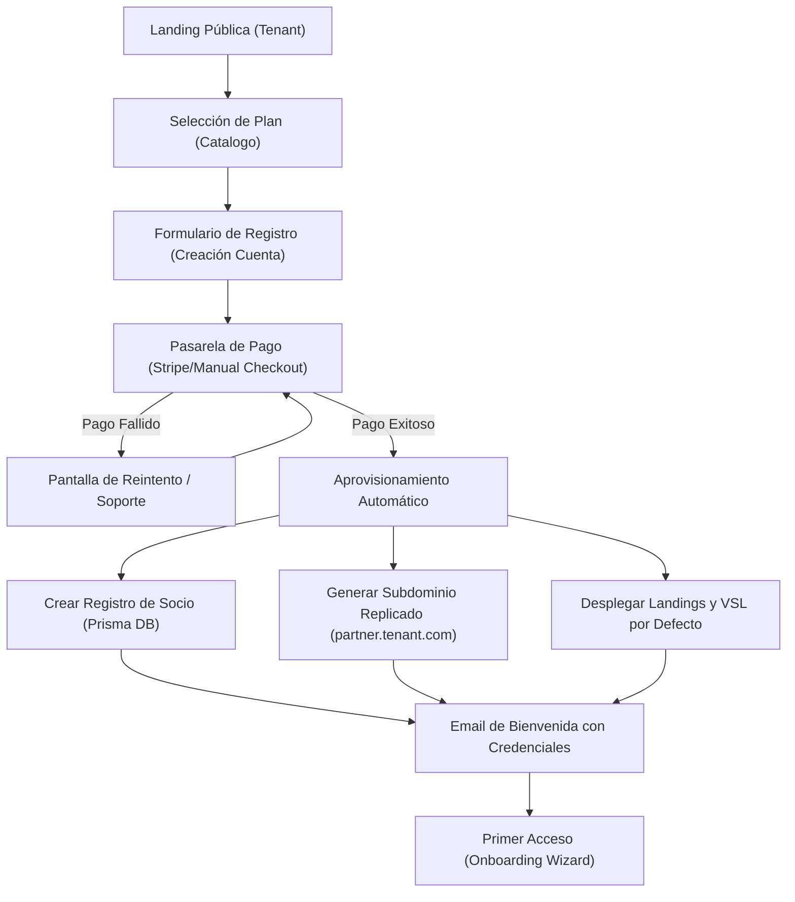
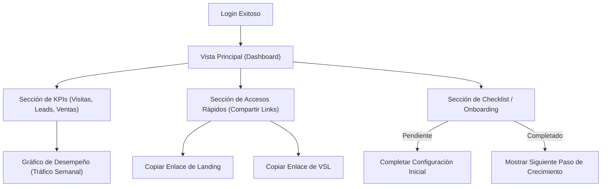
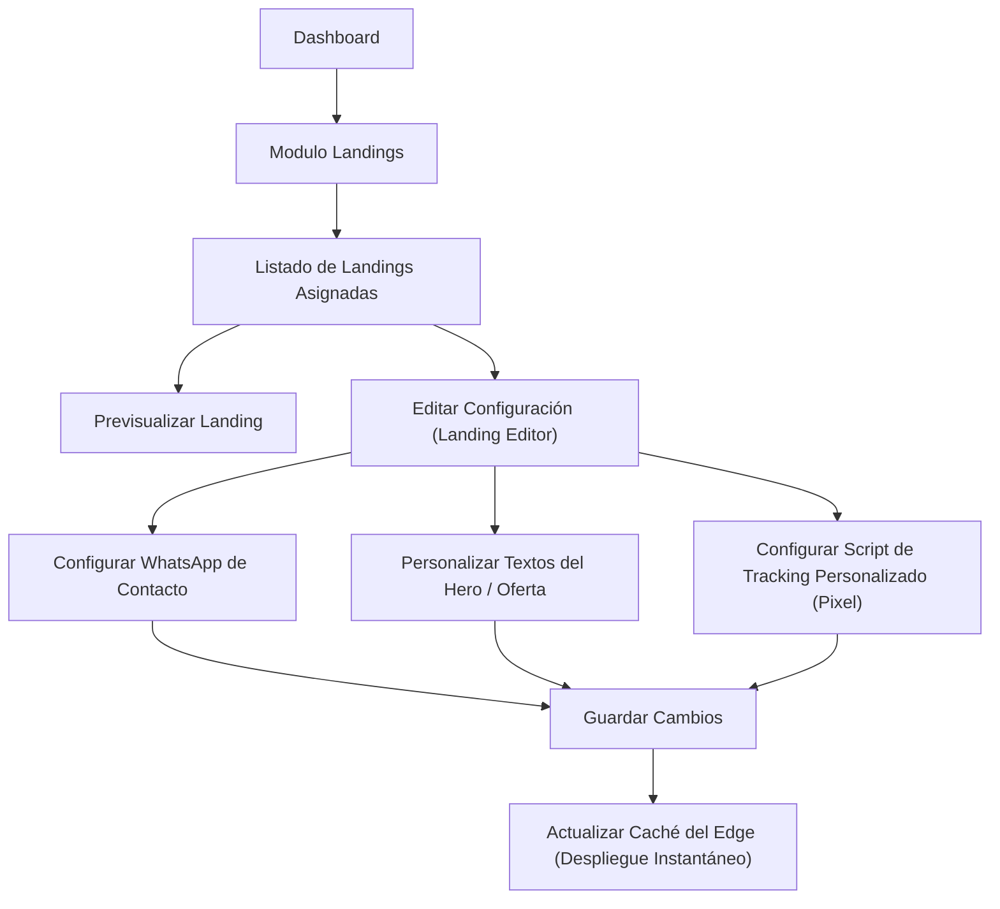
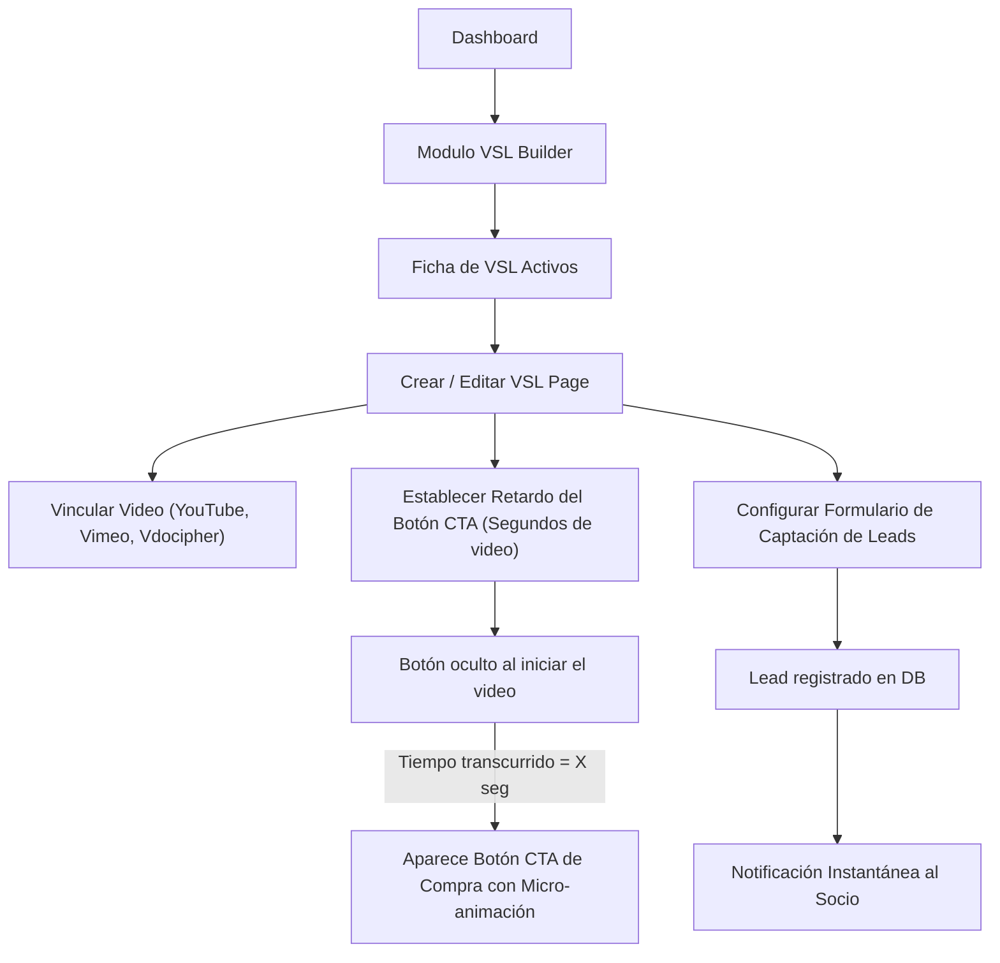
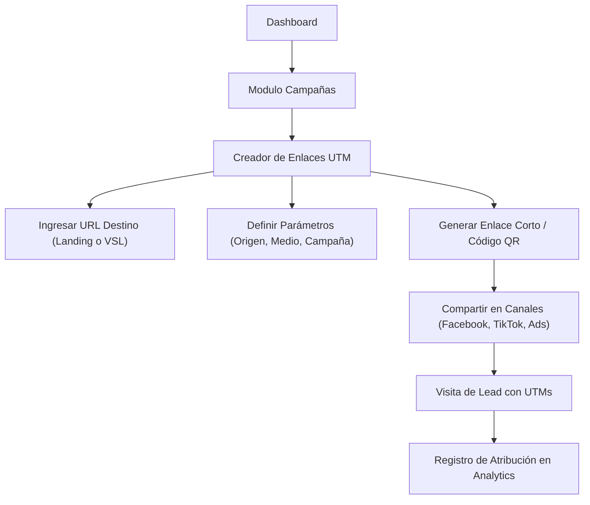
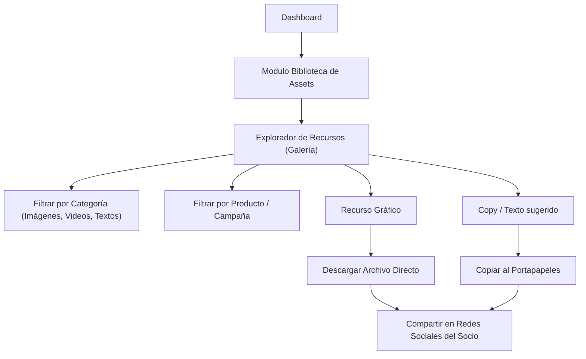
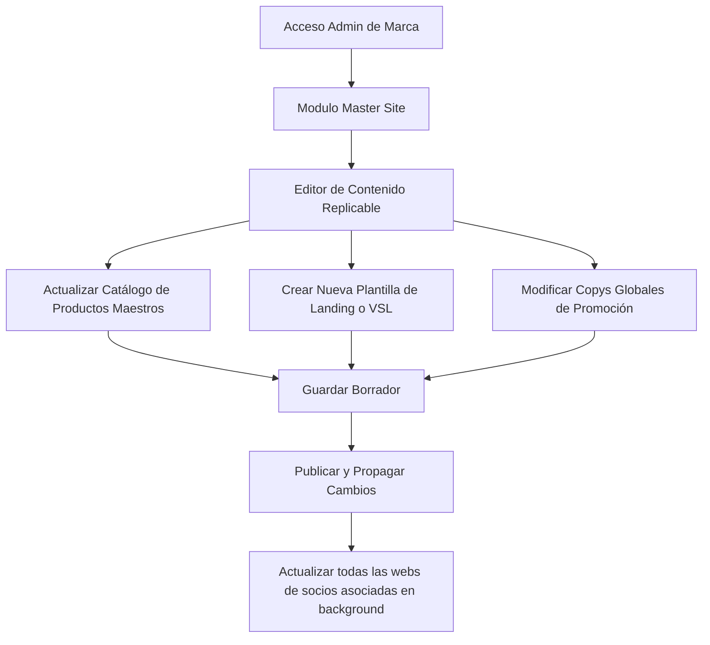
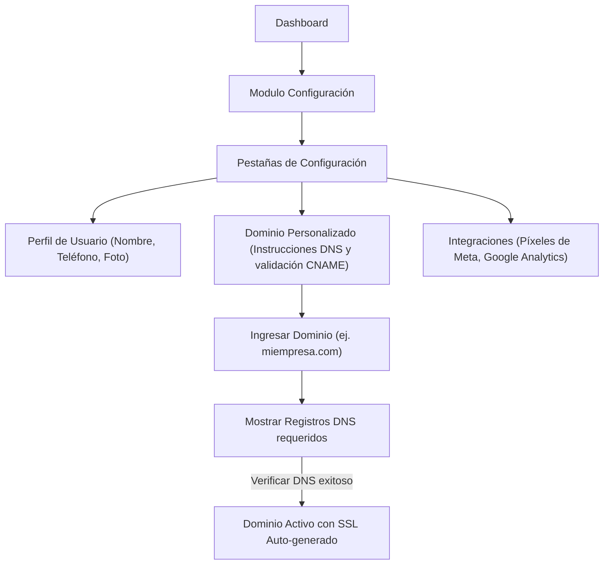

# UX User Flows — PartnerHub

> [!IMPORTANT]
> **USER_FLOWS.md is exploratory UX documentation. It is not implementation approval. Final implementation depends on PH-003A, PH-003B and PH-003C.**

# Scope Classification

Cada flujo documentado en este archivo se clasifica bajo los siguientes estados de alcance técnico:

*   **Partner Purchase**: MVP Allowed.
*   **Partner Dashboard**: Needs Role Clarification / Do Not Implement Until PH-003B.
    *   *Nota*: Partner Dashboard no equivale a dashboard del empresario. El empresario no tendrá dashboard en MVP. El dashboard inicial está permitido únicamente para fines de **admin/internal operations** (administración y operaciones internas).
*   **Landing Management**: Needs Business Validation.
*   **VSL Builder**: MVP Allowed only without AI integrations.
*   **Campaign Manager**: Future Epic / Ads Service.
*   **Asset Library**: Future Epic / Social Launch Engine.
*   **Master Site**: Admin Only.
*   **Settings**: MVP Allowed with constraints.

---

## 1. Partner Purchase (Compra de Plan por Socio)
Este flujo describe la jornada de adquisición desde que un futuro socio ingresa al embudo público de ventas del inquilino (Tenant) hasta que su entorno es aprovisionado y recibe sus credenciales.

### Acciones Clave:
- **Validación de Subdominio**: Comprobación en tiempo real para evitar nombres de subdominios duplicados durante el registro.
- **Webhook de Pago**: Disparo del flujo de aprovisionamiento en la API del Backend una vez confirmado el pago.

---

## 2. Partner Dashboard (Panel del Socio)

> [!WARNING]
> **Needs Role Clarification / Do Not Implement Until PH-003B.**
> Partner Dashboard no equivale a dashboard del empresario. El empresario no tendrá dashboard en MVP. El dashboard inicial permitido es solo para administración y operaciones internas (admin/internal operations).

Mapea la interacción diaria del socio para medir su negocio, ver estadísticas de tráfico de sus enlaces y acceder rápidamente a sus herramientas de prospección.

### Acciones Clave:
- **Micro-interacciones**: Copiado con un solo click (Feedback visual de "Copiado").
- **Gamificación**: Checklist interactivo que ayuda al socio a configurar su perfil y dominios paso a paso.

---

## 3. Landing Management (Gestión de Landings)
Describe cómo un socio puede ver, previsualizar y editar de forma básica las páginas de aterrizaje de productos replicadas a partir del Sitio Maestro.

### Acciones Clave:
- **Campos Controlados**: El socio no altera el layout principal, solo las variables permitidas (WhatsApp, Pixel ID, Título del Hero).

---

## 4. VSL Builder (Constructor VSL)

> [!NOTE]
> **MVP Allowed only without AI integrations.**
> AI video generation, HeyGen and ElevenLabs are excluded from MVP and deferred to EPIC-800 AI Content Studio.

Flujo para la creación y optimización de páginas enfocadas en Video Sales Letters (Cartas de Venta en Video) con aparición retardada del botón de compra (CTA).

### Acciones Clave:
- **Retardo Dinámico**: Sincronización del reproductor de video mediante JS para disparar eventos de visibilidad en el DOM.

---

## 5. Campaign Manager (Gestión de Campañas)

> [!WARNING]
> **Future Epic / Ads Service.**
> Future Epic. Paid campaigns are an additional service and require separate business rules, budget approval, ad account validation and cost breakdown.

Permite al socio o administrador crear enlaces parametrizados para redes sociales y pauta publicitaria, rastreando conversiones exactas.

### Acciones Clave:
- **Rastreador de Orígenes**: Asocia cada lead registrado con sus respectivas variables de UTM para reportar qué red social está trayendo mejores resultados.

---

## 6. Asset Library (Biblioteca de Recursos)

> [!WARNING]
> **Future Epic / Social Launch Engine.**
> Future Epic. Related to Social Launch Engine / Meta Assets Preparation.

Flujo para que los socios descarguen imágenes, videos publicitarios y copys listos para publicar en sus redes sociales.

### Acciones Clave:
- **Optimización de Assets**: Visualización rápida en miniatura y descargas comprimidas para optimizar ancho de banda.

---

## 7. Master Site (Sitio Maestro)
Este flujo está reservado para el Administrador del Tenant (Dueño de la marca). Define cómo crea y propaga el contenido maestro y las plantillas a todos los socios.

### Acciones Clave:
- **Propagación en Cascada**: Actualización automática de bases de datos y purga de caché global para reflejar cambios de marca en segundos.

---

## 8. Settings (Configuración)
Configuración global del inquilino y del perfil del socio.

### Acciones Clave:
- **Validación CNAME**: Botón interactivo para verificar en tiempo real si el socio apuntó correctamente sus DNS al servidor de PartnerHub.
