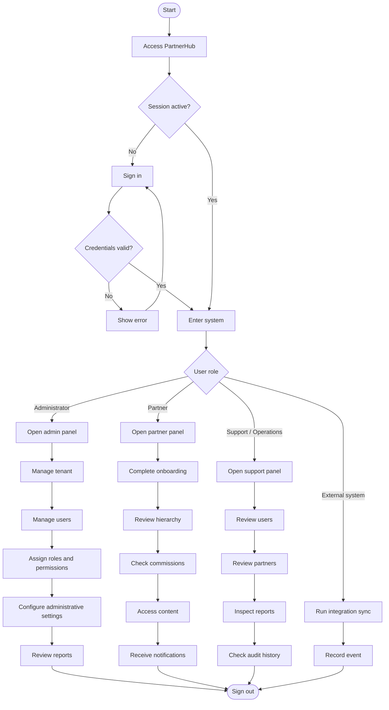

# User Flow Requirements

This document captures the user-facing flow and the core functional requirements currently defined for PartnerHub.

## Purpose

The goal is to document how a user moves through the software in a way that supports the first product requirements and the foundation roadmap.

## Primary User Flow

## Functional Requirements Reflected

- Authentication and access control
- Role-based routing after sign-in
- Administrative tenant management
- User management
- Partner management
- Role and permission assignment
- Partner onboarding
- Hierarchy visibility
- Commission visibility
- Content access
- Notifications
- Reporting
- Auditability
- External integrations

## Notes

- The flow is intentionally generic so it can support the first tenant and future tenants without redesigning the core model.
- Auditability is treated as a baseline requirement, not an optional add-on.
- This document represents the current foundation-level product view and can be expanded once implementation tickets are created.
